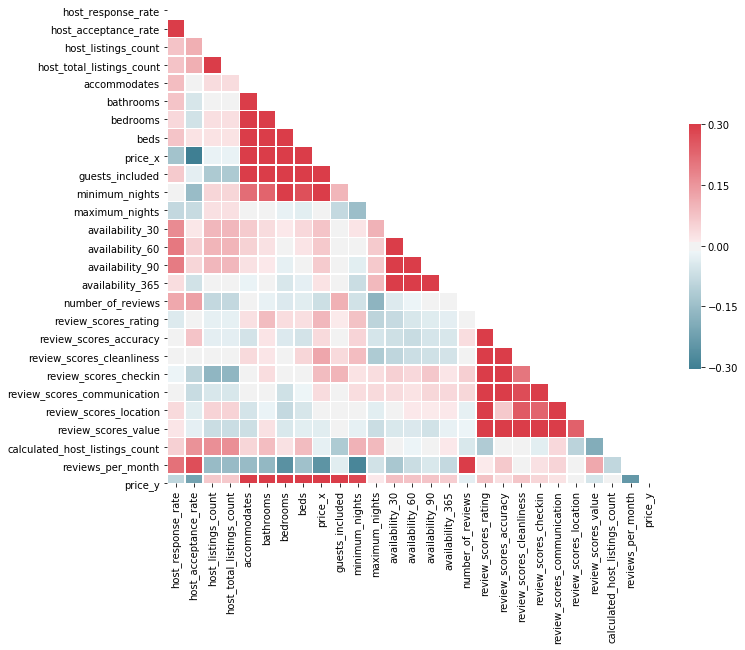
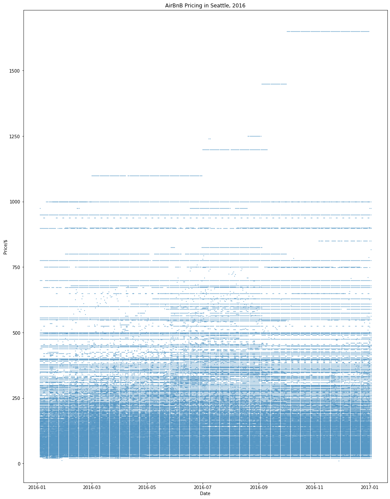
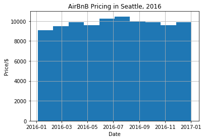
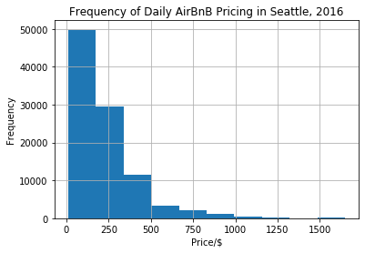
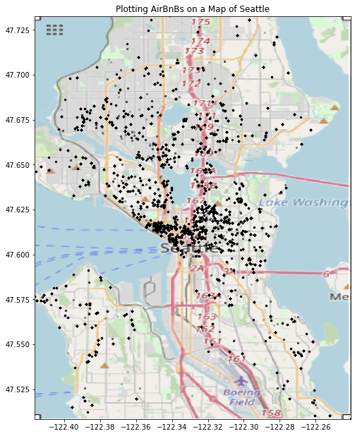

# Five Analyses of Seattle AirBnb Ratings

Some years ago I travelled to Seattle on a couple business trips. Fortunately my hotels were paid for but I would rather have stayed in an AirBnB to experience living in Seattle if I had the chance. It has spectacular views and the weather is familiar to my home here in the UK.

For future trips it will be an option, and so, using Kaggle to collect Seattle AirBnB data, I have started an analysis on host ratings based on property details and the host's relationship with their customers. Hopefully this is a sound way to find a nice property and to have a more enjoyable trip seeing friends and exploring the area.

## An Investigation Into The Data

* Which variables are closely related?
There are likely to be instances where certain attributes of the property and the host's style/rate of communication with possible lodgers contribute highly with higher or lower prices or ratings.
If for instance a host has high prices, it could be because the bathroom and bedroom are well presented, and the host knows that is why they will be more sought after.

* Can an AirBnB host set their prices based on the time of the year?
There are usually peaks for travelling and prices rise around that time. By evaluating prices during the year, a cheaper time could be chosen if the traveller's time is flexible.

* Which property details and communication style will contribute to a high AirBnB rating?
The data includes information related to the property and the style/rate of communication with possible lodgers.
If a host has a high rating then I may make quick assumptions about the property without necessarily going by all of the details on their AirBnB posting.

* Can a host rating be determined based on their property details and their relationship with their customers.
If I were to believe everything in a host's posting can I determine what their true rating should be considering they may be a new host with few reviews. It would be nice to give hosts the benefit of the doubt.

## Findings

### Which property details and communication style will contribute to a high AirBnB rating?
If a host has a high rating then I may make quick assumptions about the property without necessarily going by the details on their property or room posting.

#### Two things that hosts can focus on to improve their standing with lodgers.

Listing price appears to increase with:
** Cleanliness
** Ratings

If hosts concentrate on the cleanliness of their property they'd be in a good position to increase their daily rates, which wouldn't affect their ratings - Win, win!

[Source: Giphy]https://gph.is/1L5kQ7j

Review scores appear to increase with:
** The number of bathrooms
** The number of bedrooms
** Minimum nights

From this we can assume that if the number of _bathrooms_, _bedrooms_ and _minimum number of nights_ suited the lodgers, then they would leave high reviews. However, these would need *further analysis*. For instance we would look into which number of bathrooms, bedrooms and minimum nights were most sought after based on the number of lodgers.

Maybe there is a minimum number of nights that lead to higher review ratings.
Maybe a host will be able to use the results to cap the minimum/maximum number of nights that a lodger may stay.

The host's rate of communication with possible lodgers appears to increase with the number of reviews that the host receives per month. This shows that the impact of fast communication is that more people stay in the property and therefore more reviews will result.

Hosts are also more likely to respond quickly when multiple guest are staying; supposedly because they expect more money than a single occupant.

#### Take a Look at this example correlation chart.
We look for red and dark blue for positive and negative correlation respectively.
Positive correlation means that as one increases so does the other; the same for decreasing values.
Negative correlation means that as one increases the other decreases.

### Can an AirBnB host set their prices based on the time of the year?
Looking at the three charts below we can see there are times of the year that the prices increase and decrease, even though the most frequent range of prices is up to 200 US dollars.

There is a definite summer peak, which is expected during the school holidays, and a higher density and wider variety of prices are available at this time, showing that hosting tends to be seasonal. If I'm a host that doesn't have time to make my property available all-year-round then I can concentrate on making the most of the summer months where I may command higher prices, and have more frequent occupants. June to August is the peak for prices, and hosts tend to increase their prices for those months.

If I have flexible travelling time I would choose January or February as I could get a nice property for less than other times of the year.

### The Location of an AirBnB
*This is another stage of price analysis, which will be covered another time*

### Can a host rating be determined based on their property details and their relationship with their customers.
Suppose we like the look of a property but the host is new or has few reviews on which we may base our decision.
Using the numerical data in the AirBnB dataset, the host rating has be predicted using a linear model with an accuracy of ~53%. The linear model was not ideal for categorical data, so other predictive models will be investigated at a later time. With ensemble models the decisions from multiple models will be combined to improve the overall performance from 53%. By combining different models this will lead to more flexibility (less bias) and less data sensitivity (less variance).

## Summary of the Results
This analysis was meant for both hosts and lodgers to gain some insight into the AirBnB market in Seattle. It may be expected that other cities mirror the same trend, at least in the Northern hemisphere, though one thing to bare in mind is travelling for popular events, like conferences. Events that don't occur every year would likely change the price range unexpectedly. Future analysis would be to combine conference data with AirBnB data to check trends in that instance. 

It would be interesting to see how the price chart differs to a city in Austrailia, like Sydney.
Can you think of any major cities that may not follow this trend?
Has there been a time where this trend would change for us here in the Northern Hemisphere? 

# Implementation:
## Technical Information

### Installation
1. Fork / Install the files into a folder on your computer
1. Download Jupyter Notebook to use the files

##### Libraries used:
1. Numpy
1. Pandas
1. Datetime
1. Matplotlib.pyplot
1. Seaborn

### File Descriptions
seattle_airbnb_review.ipynb: the python code which anaylzes the data in the Seattle airbnb csv files.
reviews.csv: the unique ids for each reviewer and their comments about their stay
listings.csv: the full property descriptions and average review scores
calendar.csv: the listing ids, the prices, and future availability
seattle_map.png: a drawing of  to use as the border of the map for plotting the longitude and latitude of the properties.

### How To Interact With The Project
Run the Jupyter Notebook cells in order. There are charts and maps that explain the data findings.

### Licensing, Authors, Acknowledgements

The data files were retrieved from [Kaggle]https://www.kaggle.com/airbnb/seattle
Thanks to my mentors at [Udacity]https://www.udacity.com/ for helping me to understand my results
